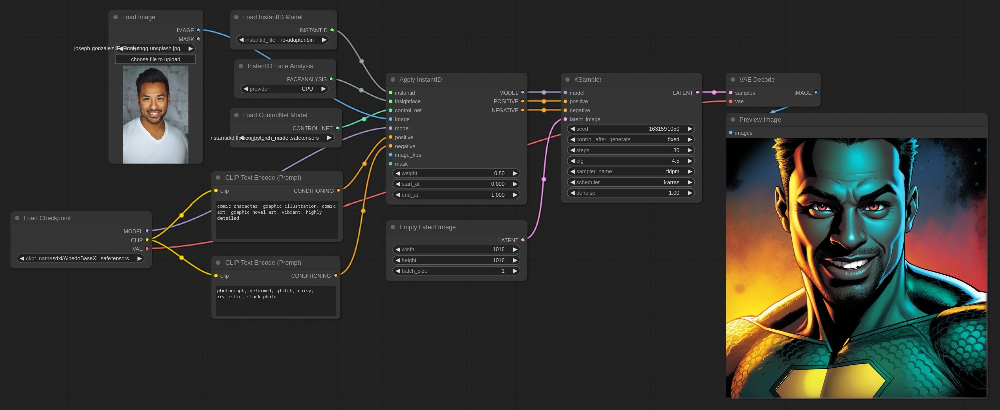

# ComfyUI InstantID (Native Support)

Native [InstantID](https://github.com/InstantID/InstantID) support for [ComfyUI](https://github.com/comfyanonymous/ComfyUI).

This extension differs from the many already available as it doesn't use *diffusers* but instead implements InstantID natively and it fully integrates with ComfyUI.

## Important updates

- **2024/02/20:** I refactored the nodes so they are hopefully easier to use. **This is a breaking update**, the previous workflows won't work anymore.

## Basic Workflow

In the `examples` directory you'll find some basic workflows.

## Video Tutorial

**:movie_camera: [Introduction to InstantID features](https://youtu.be/wMLiGhogOPE)**

## Installation

**Upgrade ComfyUI to the latest version!**

Download or `git clone` this repository into the `ComfyUI/custom_nodes/` directory. I guess the Manager will soon have this added to the list.

InstantID requires `insightface`, you need to add it to your libraries together with `onnxruntime` and `onnxruntime-gpu`.

The InsightFace model is **antelopev2** (not the classic buffalo_l). Download the models (for example from [here](https://drive.google.com/file/d/18wEUfMNohBJ4K3Ly5wpTejPfDzp-8fI8/view?usp=sharing) or [here](https://huggingface.co/MonsterMMORPG/tools/tree/main)), unzip and place them in the `ComfyUI/models/insightface/models/antelopev2` directory.

The **main model** can be downloaded from [HuggingFace](https://huggingface.co/InstantX/InstantID/resolve/main/ip-adapter.bin?download=true) and should be placed into the `ComfyUI/models/instantid` directory. (Note that the model is called *ip_adapter* as it is based on the [IPAdapter](https://github.com/tencent-ailab/IP-Adapter)).

You also needs a [controlnet](https://huggingface.co/InstantX/InstantID/resolve/main/ControlNetModel/diffusion_pytorch_model.safetensors?download=true), place it in the ComfyUI controlnet directory.

**Remember at the moment this is only for SDXL.**

## Watermarks!

The training data is full of watermarks, to avoid them to show up in your generations use a resolution slightly different from 1024×1024 (or the standard ones) for example **1016×1016** works pretty well.

## Lower the CFG!

It's important to lower the CFG to at least 4/5 or you can use the `RescaleCFG` node.

## Face keypoints

The person is posed based on the keypoints generated from the reference image. You can use a different pose by sending an image to the `image_kps` input.

## Additional Controlnets

You can add more controlnets to the generation. An example workflow for depth controlnet is provided.

## Styling with IPAdapter

It's possible to style the composition with IPAdapter. An example is provided.

## Multi-ID

Multi-ID is supported but the workflow is a bit complicated and the generation slower. I'll check if I can find a better way of doing it. The "hackish" workflow is provided in the example directory.

## Advanced Node

There's an InstantID advanced node available, at the moment the only difference with the standard one is that you can set the weights for the instantID models and the controlnet separately. It might be helpful for finetuning.

The instantID model influences the composition of about 25%, the rest is the controlnet.

## Other notes

It works very well with SDXL Turbo. Best results with community's checkpoints.

